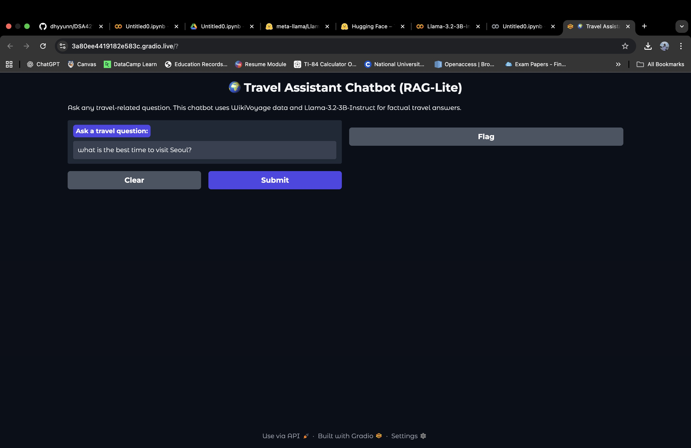

# Travel Assistant Chatbot (DSA4213 Project)

## Overview
TThis project develops a Retrieval-Augmented Generation (RAG) based Travel Assistant Chatbot that provides factual, concise answers to travel-related questions (e.g., transport, attractions, cultural tips).

The chatbot integrates:
Llama-3.2-3B-Instruct as the generation backbone
BGE-Large-v1.5 as the semantic retriever
FAISS for efficient similarity search
A WikiVoyage knowledge base (≈200K chunks)

We further benchmark *Baseline*, *RAG (Top-k)*, and *Reranked RAG* variants and evaluate performance using semantic similarity metrics.

### Important Note !!
The Python scripts in src/ are designed for evaluation and experimentation (not as interactive chatbots). 
However, for interactive purpose, a user interface was designed using gradio in gradio_app.py.
For ease of reproduction, please use the notebook notebooks/testing_llama3.2.ipynb (Option 1 for *How to run* section), which runs all experiments sequentially and generates the evaluation results under reports/.
The model used *Llama-3.2-3B-Instruct* is a gated model, which requires user's application via its official website on Hugging Face. Please ensure you have access to the model before you run the notebook. The official website: https://huggingface.co/meta-llama/Llama-3.2-3B-Instruct


---

## Project Structure
| Folder | Description |
|--------|--------------|
| `data/` | JSONL knowledge base, FAQs, and evaluation queries. But the dataset was too large, so we removed it here. |
| `src/` | All source code to evaluate models perfomance. |
| `reports/` | Project documentation and final report. |
| `notebooks/` | The notebook to run this project entirely. |


---

## Setup
### Clone the repository
```bash
git clone https://github.com/dhyyunn/DSA4213-group-project-travel-assistant-chatbot.git
cd DSA4213-group-project-travel-assistant-chatbot
```
### Create a virtual environment
``` bash
python3 -m venv venv
source venv/bin/activate       # (Mac/Linux)
venv\Scripts\activate          # (Windows)
```

### Install dependencies
```bash
pip install -r requirements.txt
```

## How to run
### Option A: (without interactive UI)
#### a) open the notebook
Open notebooks/testing_llama3.2.ipynb in Google Colab or VS Code Jupyter.

#### b) Set Runtime
Change your runtime to GPU

#### c) Run Sequentially
Run the notebook top to bottom — it includes:
1.	Environment setup & imports
2.	Load model + retriever
3.	Build FAISS index
4.	Run Baseline
5.	Run RAG (Top-k)
6.	Run RAG (Reranked)
7.	Generate evaluation reports
8.	Visualize results

All generated results are saved to reports/.

### Option B: (With interactive UI)
#### a) Baseline Evaluation
```bash
python3 src/baseline_llama3.2.py
```
Generates reports/evaluation_llama3.2_baseline.csv

#### b) RAG-Lite (Top-k=3)
```bash
python3 src/raglite_chatbot.py
```
Outputs average semantic similarity and bar chart.

#### c) RAG with Reranking
```bash
python3 src/rag_rerank_chatbot.py
```
Produces evaluation_llama3.2_RAG_reranked.csv

#### d) Interactive Chatbot Demo (Gradio UI)
```bash
python3 src/gradio_app.py
```
Wait ≈ 1–2 min for model load → access the public link from Gradio.


## Evaluation metrics
Semantic Similarity (cosine similarity of BGE embeddings)
Quantitative comparison of Baseline vs RAG variants
Visualization of per-query scores and average improvement

## Interactive Demo
The Gradio interface provides a simple textbox to ask travel questions and see the RAG-generated answer plus top retrieved contexts.
```bash
python3 src/gradio_app.py
```
*Tips:First query loads models (~1–2 min), subsequent responses are instant (2–4 s).*


## Developer Notes
Heavy components (model, retriever, FAISS index) are cached globally to reduce latency.
All scripts are import-safe (if __name__ == "__main__":) and modular.
Outputs and figures are automatically saved to reports/.

## Output Files
| File| Description |
|--------|--------------|
| `evaluation_llama3.2_baseline.csv` | Model only QA results.|
| `evaluation_llama3.2_RAG.csv` | RAG Top-k (k=3) results |
| `evaluation_llama3.2_RAG_reranked.csv` | RAG with reranking results |